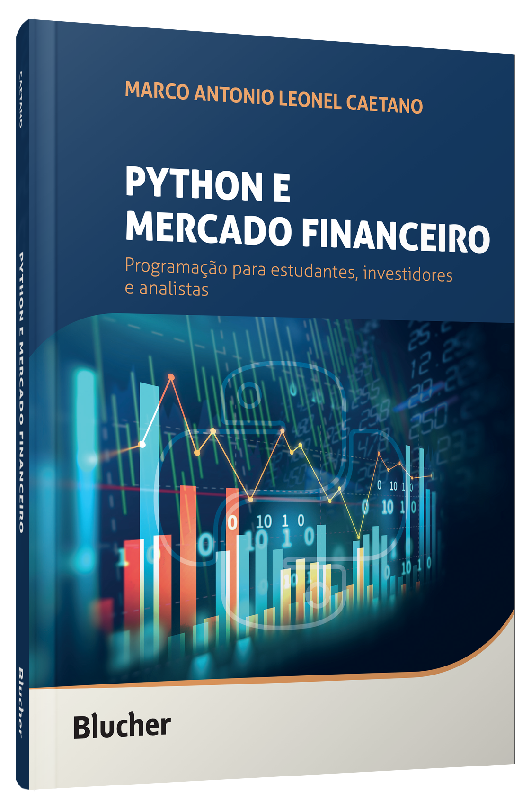

# 📘 Python e Mercado Financeiro
Este repositório reúne todos os códigos em Python e Jupyter Notebooks baseados no livro Python e Mercado Financeiro, 
de Marco Antonio Leonel Caetano. O conteúdo é excelente e tem me ajudado bastante! Estou estudando programação voltada para estudantes, 
investidores e analistas, com base nesse material, para aprofundar meus conhecimentos em finanças com Python. 
Leio o livro todos os dias e coloco os exemplos em prática tanto no Visual Studio Code quanto no PyCharm. 
mas sigo praticando diariamente com foco em leitura técnica.

# 📖 O Livro
Python e Mercado Financeiro: Programação Para Estudantes, Investidores e Analistas

# 📸 Fotos
 

  

 

## Marco Antonio Leonel Caetano

# [📚 Link para compra na Amazon](https://www.amazon.com.br/Python-Mercado-Financeiro-Programa%C3%A7%C3%A3o-Investidores/dp/6555062401/ref=sr_1_1?camp=1789&creative=9325&dib=eyJ2IjoiMSJ9.gOChy-ez7lMa85Il_KHl9PX5G2Awkxvua3RQtWdvOcvGjHj071QN20LucGBJIEps.RSu-QFW9_LxiU78WlzABbBtQw7s5hMaabvv9rz-MW2o&dib_tag=se&keywords=Python+e+Mercado+Financeiro%3A+Programa%C3%A7%C3%A3o+Para+Estudantes%2C+Investidores+e+Analistas&linkCode=ur2&linkId=f1e271cfc2549b0b16268c131bf693c7&qid=1751246069&s=books&sr=1-1-catcorr&ufe=app_do%3Aamzn1.fos.6121c6c4-c969-43ae-92f7-cc248fc6181d)

# 🗂️ Conteúdo por Capítulo

Cap1_Principios_Programacao.py

Cap2_Iteracao_Decisao.py

Cap3_Estatistica_Mercado.py

Cap4_Graficos_Analises.py

Cap5_Funcoes.py

Сарб_Arrays.py

Cap7_Time_Datetime.py

Cap8_Pandas.py

Cap9_Financas_Python.py

Cap10_Datareader_YahooFinance.py

Cap11_Processamento_Paralelo.py

Cap12_Google_Trends.py

Cap13_IA_Mercado.py

🙌 Agradecimento
O livro Python e Mercado Financeiro, de Marco Antonio Leonel Caetano, é excelente!
Estou aprendendo muito e recomendo com entusiasmo.
Muito bom, legal, ótima leitura! 😊📈

## 👨‍💻 Autor

- [GitHub](https://github.com/brumab) | [LinkedIn](https://www.linkedin.com/in/brumab1122/) | [cv](https://brumab.github.io/cur/)

